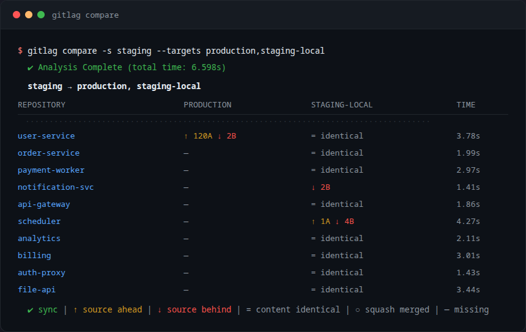
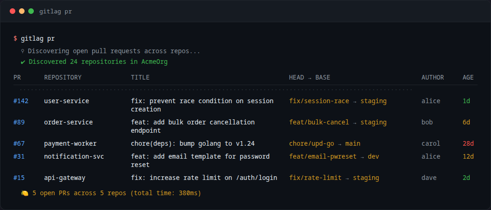
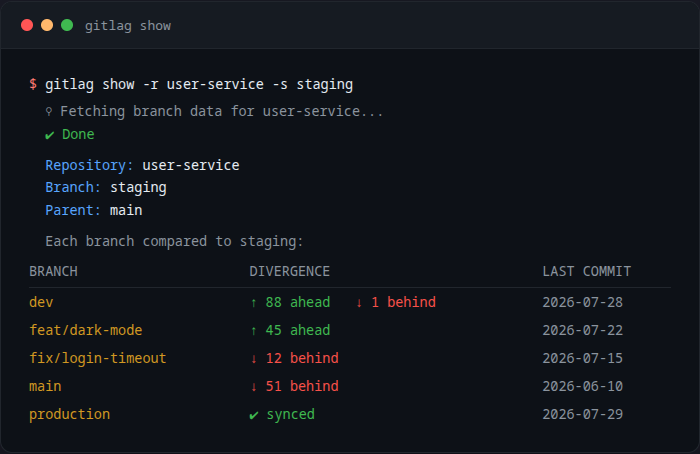

# gitlag

[](https://go.dev)
[](LICENSE)
[](#)

Branch divergence and PR orchestration for Gitea — without cloning a single repo.

No disk cache. No shallow-clone bugs. Just Gitea's API doing the heavy lifting.

## Key Features

- **Zero-Clone Architecture**: All data comes from Gitea's compare API — always accurate, no local sprawl.
- **Branch Diffing**: Per-repo breakdown of commits ahead/behind between any two branches.
- **Org-Wide PR Dashboard**: Every open PR across every repo, with color-coded age and word-wrapped titles.
- ~~**AI Code Review** — use your own coding agent to review PRs instead~~
- **Multiple Output Formats**: Table (terminal), JSON (scripts), CSV (spreadsheets), Markdown (docs/issues).
- **Shell Completion**: Native completion for bash, zsh, fish, and PowerShell.
- **Parent Branch Detection**: Automatic — git upstream, config mapping, naming conventions, fallback to `main`.

## Prerequisites

- **Go 1.23+** and **git**
- **Gitea** instance with API token (org read + repo read access)
<details>
<summary>Where to find your Gitea token</summary>

1. Log into your Gitea instance
2. Settings → Applications → Manage Access Tokens
3. Generate a token with `read:repository` and `read:organization` scopes
4. Set as env var: `export GITEA_TOKEN="your_token_here"`
</details>

## Install

```bash
go install github.com/mystaline/gitlag/cmd/gitlag@latest
```

Or clone and build:

```bash
git clone https://github.com/mystaline/gitlag.git
cd gitlag
make build        # outputs bin/gitlag
make install      # installs to ~/go/bin
```

Make sure `~/go/bin` is on your `$PATH`:

```bash
export PATH=$HOME/go/bin:$PATH
```

Works on **Linux**, **macOS**, **Windows** (native and WSL2).

## Quickstart

```bash
# 1. Set your Gitea token
export GITEA_TOKEN="your_token_here"

# 2. Create config from example
cp configs/gitlag.example.yaml ~/.gitlag.yaml    # then edit

# 3. See how staging stacks up against dev across all repos
gitlag compare -s staging --targets dev

# 4. Check open PRs across the org
gitlag pr

# 5. Deep-dive on one repo's branches
gitlag show -r backend-api -s staging

# 6. AI review a specific PR (experimental, use your own coding agent instead)
gitlag review --repo backend-api --pr 42
```

## Configuration

Drop this at `~/.gitlag.yaml`:

```yaml
gitea:
  url: https://gitea.example.com
  token: ${GITEA_TOKEN}

  repos:
    - org: my-org
      include:
        - service-*
      exclude:
        - "*-legacy"

```

See [`configs/gitlag.example.yaml`](configs/gitlag.example.yaml) for a full annotated example.

## Commands

### `compare` — who's ahead, who's behind

```bash
gitlag compare -s staging --targets dev,main,release
```

| Icon | Meaning |
|------|---------|
| `↑ N ahead` | Source branch has commits the target doesn't |
| `↓ N behind` | Target has commits the source doesn't |
| `✔ sync` | Branches are in sync |



### `pr` — what's waiting for review

```bash
gitlag pr
```

AGE is color-coded: green ≤ 3 days, yellow ≤ 14 days, red beyond that.



### `show` — single repo detail

```bash
gitlag show -r backend-api -s staging
```

Shows every branch's divergence: `↑ ahead of source`, `↓ behind source`, `✓ synced`.



### ~~`review` — AI code review (strikethrough, use your own coding agent)~~

### `version`

```bash
gitlag version
```

### Flags

| Flag            | Scope        | Description                                       |
| --------------- | ------------ | ------------------------------------------------- |
| `--config`      | global       | Config path (default `~/.gitlag.yaml`)            |
| `--format`      | global       | Output: `table` (default), `json`, `csv`, `markdown` |
| `-s, --source`  | compare/show | Source branch to compare from                     |
| `-t, --targets` | compare      | Comma-separated target branches                   |
| `-r, --repo`    | show/review  | Repository name                                   |
| `-n, --pr`      | review       | Pull request number (strikethrough — see note)    |
| `--org`         | review       | Organization (optional, auto-detected)            |

> ~~review command — use your own coding agent to review PRs instead~~

### Output formats

```bash
gitlag pr --format csv > prs.csv
gitlag pr --format json | jq '[.[] | select(.age_days > 14)]'
gitlag compare -s staging --targets dev --format markdown
```

## Shell completion

**zsh:**
```bash
gitlag completion zsh > "${fpath[1]}/_gitlag" && source "${fpath[1]}/_gitlag"
```

**bash:**
```bash
gitlag completion bash >> ~/.bashrc && source ~/.bashrc
```

**fish:**
```bash
gitlag completion fish > ~/.config/fish/completions/gitlag.fish
```

## Testing

```bash
go test ./...              # full suite
go test ./... -v           # verbose
go test ./... -cover       # with coverage
```

## Troubleshooting

| Problem | Likely cause | Fix |
|---------|-------------|-----|
| `401 Unauthorized` on all requests | Missing or invalid `GITEA_TOKEN` | Set `export GITEA_TOKEN=...` and verify token has `read:repository` + `read:organization` scopes |
| `no repositories found` | Config org name wrong, or `include` pattern matches nothing | Check org spelling and glob patterns in config |
| Config not found | File named `.gitlag.yaml` vs `gitlag.yaml` | Try `--config ~/.gitlag.yaml` |
| AI review returns nothing | Missing API key or wrong provider/model | Check your `DEEPSEEK_API_KEY` (or equivalent) and `ai.provider`/`ai.model` in config |
| `compare` shows no data | Source branch doesn't exist in one or more repos | Verify branch name across all tracked repos |
| <code>review</code> unreliable | AI model quality varies | Use your own coding agent instead |

## Roadmap

- [ ] **GitHub / GitLab / Bitbucket** — native API providers beyond Gitea. (worth: high, effort: medium)
- [ ] **Ghost commit detection** — squash-merge and rebase detection for accurate divergence counts. (worth: high, effort: low)
- [ ] ~~**Webhook mode** — listen for PR events, auto-review, post results as PR comments. (worth: medium, effort: medium)~~
- [ ] ~~**Review caching** — skip re-review of unchanged PR diffs. (worth: medium, effort: low)~~
- [ ] ~~**Concurrent review** — batch-review multiple PRs in one pass. (worth: medium, effort: low)~~
- [ ] ~~**Visual dashboard** — web UI for org-wide branch health. (worth: low, effort: high)~~
- [ ] ~~**Slack integration** — post stale PR alerts to channels. (worth: low, effort: medium)~~

## License

MIT
---

**[→ mystaline.dev](https://mystaline.dev)** — full portfolio & project writeups
